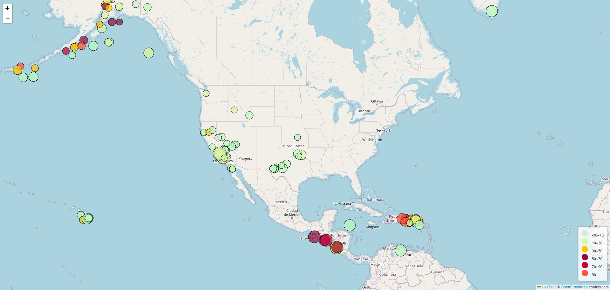

# Transforming Earthquake Data into Dynamic Insights

Melissa Morales

# Reference Dataset
[United States Geological Survey (USGS) GeoJSON Summary Format](https://earthquake.usgs.gov/earthquakes/feed/v1.0/summary/2.5_week.geojson)

# Overview

The United States Geological Survey (USGS) provides essential scientific data on earthquake magnitudes, depths, and locations. 

A recent analysis examined a global dataset of earthquakes from the past seven days, focusing on those with magnitudes exceeding 2.5. 

To enhance data visualization, an interactive map was developed using JavaScript and the D3 library. Additionally, the non-spatial attributes were investigated through the hierarchical structure of GeoJSON files.

